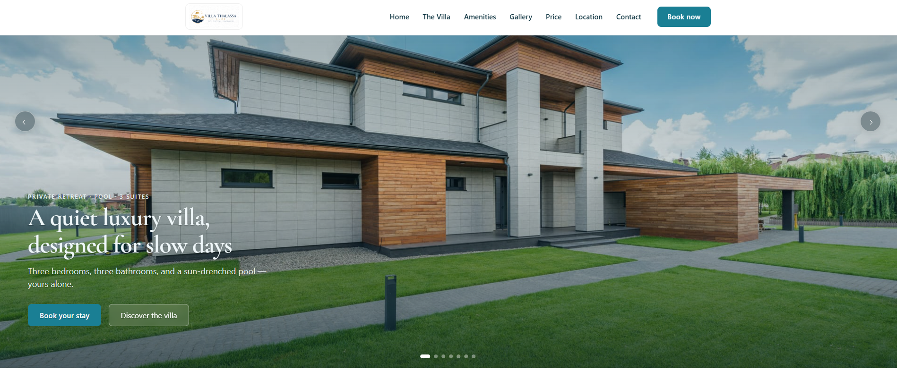
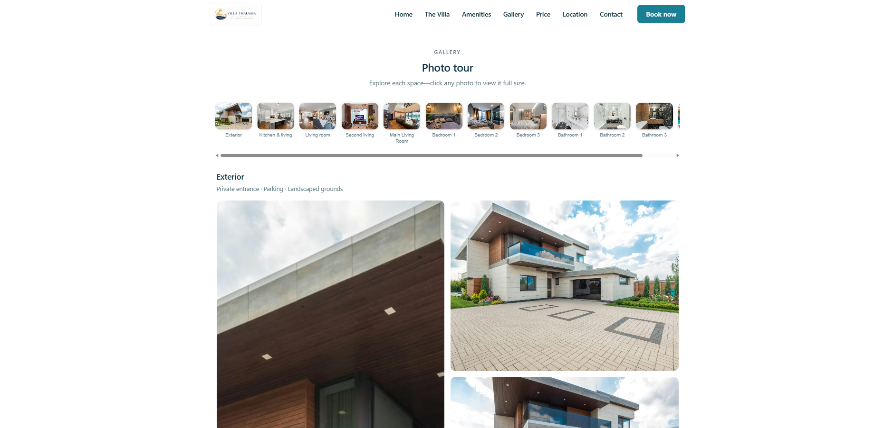
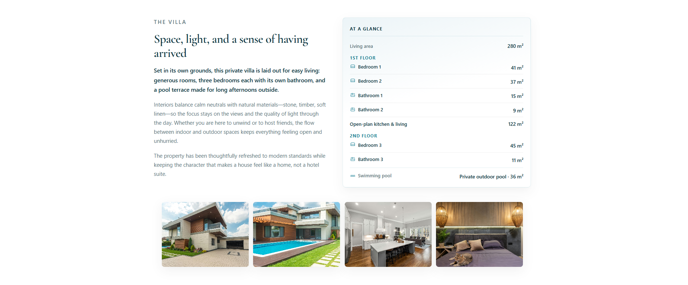
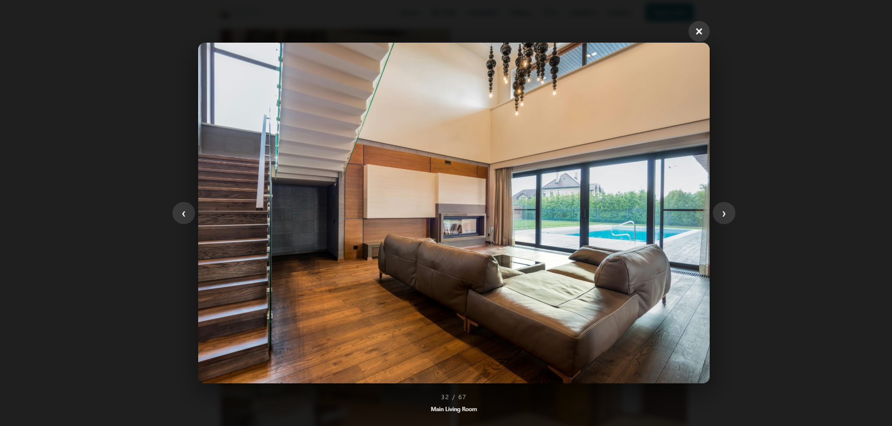
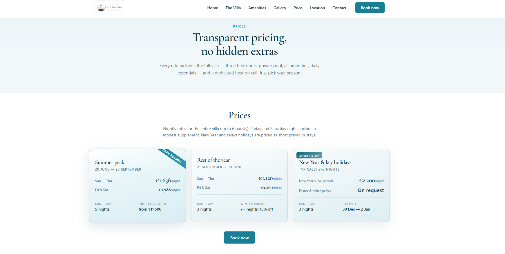

# 🏖️ Luxury Villa Website

> ✨ A polished, **single-property** marketing site for an upscale vacation rental — hero carousel, photo tour, transparent pricing, and booking-focused contact flow.  
> 🌊 Slow days, sun-drenched pool, three suites — all wrapped in calm typography and photography-first layout.

---

## 📸 Screenshots

### 🏠 Home & hero

Full-width **hero carousel** with prev/next, dots, autoplay (respects reduced motion), and clear **Book** / **Discover** calls to action.



### 🖼️ Photo tour (Gallery)

**Category chips** jump to room sections; each area has summaries and a responsive grid. Built for dozens of high-res shots without feeling cluttered.



### 🏡 The Villa

Editorial **story + specs**: “At a glance” floor plans with icons, living area totals, and thumbnail strip for quick visual scanning.



### 🔍 Full-screen lightbox

Keyboard-friendly viewer: **Escape** to close, **arrow keys** to move through the **entire** gallery sequence with counter and room label.



### 💰 Rates & pricing

Seasonal **pricing cards**, minimum stays, and promos — same nav and **Book now** rhythm as the rest of the site.



---

## 🎯 What this project is

| | |
| :--- | :--- |
| 🧳 **Audience** | Guests comparing a **private villa** (families, small groups, slow-travel seekers). |
| 🎨 **Goal** | High-trust **showcase**: property story, amenities, location, gallery, and **how to book**. |
| 📱 **Experience** | Responsive layout, accessible navigation (mobile menu, focus return, ARIA on carousel/lightbox). |
| ✉️ **Contact** | Enquiry form that can open the visitor’s mail client (`mailto:`) when configured, or post to a remote URL if you set `action`. |

Pages you get out of the box:

- 🏠 **`index.html`** — Hero, villa story, amenities, location, contact.  
- 🗂️ **`gallery.html`** — Dynamic photo tour (rooms defined in `app.js`).  
- 💵 **`rates.html`** — Pricing and stay rules.

---

## 🛠️ Tech stack

No framework churn — just the web platform, done carefully:

| Layer | Stack |
| :---: | :--- |
| 📄 **Markup** | Semantic **HTML5** (landmarks, labels, carousel/lightbox patterns). |
| 🎨 **Styles** | **CSS3** — `base.css` (foundation) + `styles.css` (components, layout, themes). |
| ⚡ **Behavior** | **Vanilla JavaScript** (`app.js`, loaded with `defer`) — IIFEs, DOM APIs, no build step. |
| 🔤 **Typography** | **Google Fonts** — [Cormorant Garamond](https://fonts.google.com/specimen/Cormorant+Garamond) for an editorial luxury feel. |
| 🖼️ **Assets** | Optimized **JPG/PNG** imagery under `assets/images/` (hero, rooms, logo). |

Optional for local dev: any **static file server** (Live Server, `npx serve`, etc.) — some browsers are stricter with `file://` for modules or future APIs; this project uses classic script tags, so opening `index.html` directly often works too.

---

## 🚀 Quick start

1. 📥 Clone or download the repo.  
2. 🌐 Open **`index.html`** in a browser **or** serve the folder with your favorite static server.  
3. ✏️ Swap copy, images, and `data-contact-email` on the contact form to match your property.  
4. 🎉 Ship to **GitHub Pages**, **Netlify**, **Cloudflare Pages**, or any static host.

---

## 📁 Project layout (high level)

```
luxury-villa-website/
├── index.html          # 🏠 Main landing
├── gallery.html        # 🖼️ Photo tour
├── rates.html          # 💰 Pricing
├── base.css            # 🧱 Base tokens & resets
├── styles.css          # 🎨 Full design system
├── app.js              # ⚡ Nav, hero, lightboxes, gallery render, contact
├── assets/
│   ├── images/         # 📷 Photography & logo
│   └── screenshots/    # 📸 README visuals (you are here!)
└── README.md           # 👋 This file
```

---

## 💖 Credits & vibe

Built as a **luxury hospitality** front-end: lots of whitespace, serif headlines, teal accents, and photography that does the selling.  

If you extend it, keep **performance** (lazy images are already in play on the gallery) and **a11y** (keyboard + screen reader labels) in mind — they’re part of what makes the site feel “premium.” 🌟

---

<p align="center">
  <strong>🏡 Happy hosting — may your calendar stay full and your pool stay blue. 💙</strong>
</p>
